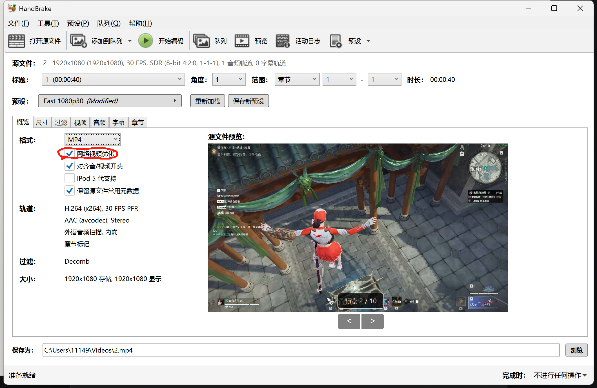
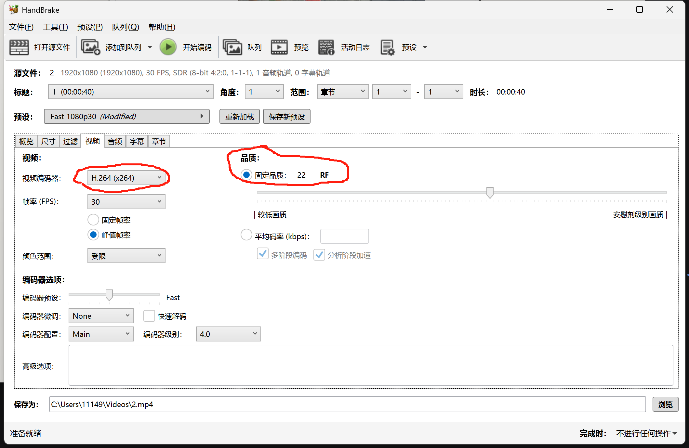
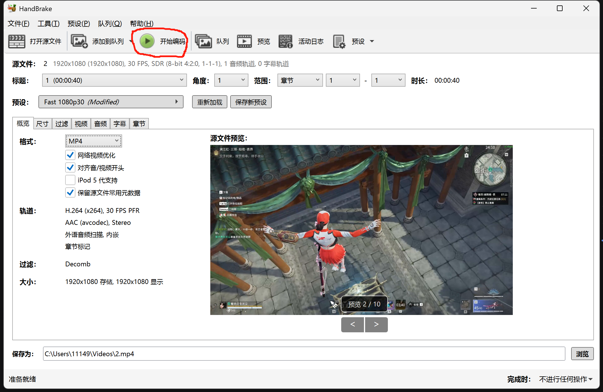
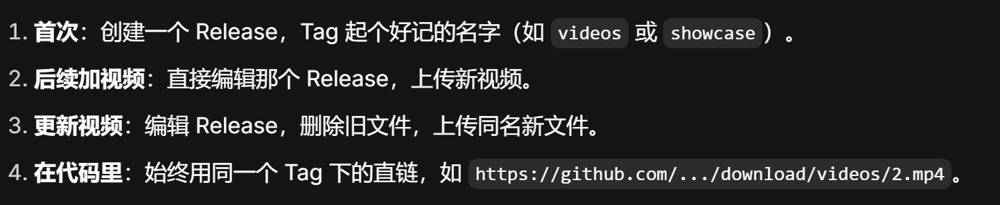

## B站方案托管视频

[如何在博客中添加和优化B站视频外链 - OneMuggle](https://www.521101.xyz/index.php/archives/318.html)

**清晰度比较受限。**

```html
# 点击可以跳转B站
<iframe 
src="//player.bilibili.com/player.html?bvid=BV1ijn9eWE2k" 
scrolling="no" 
border="0" 
frameborder="no" 
framespacing="0" 
width="100%" 
height="500" 
allowfullscreen="true"
>
</iframe>
```

```html
# 点击不能跳转
<iframe 
src="//player.bilibili.com/player.html?bvid=BV1ijn9eWE2k" 
scrolling="no" 
border="0" 
frameborder="no" 
framespacing="0" 
width="100%" 
height="500" 
allowfullscreen="true" 
sandbox="allow-top-navigation allow-same-origin allow-forms allow-scripts"
>
</iframe>
```


## Release方案托管视频


**准备一个视频。**

### **预处理视频**

**在上传视频之前对视频进行预处理**，使用工具HandBrake.
[HandBrake: Open Source Video Transcoder](https://handbrake.fr/)
处理方法：

#1 在概览 summary 界面，勾选网络视频优化选项。



#2  在视频 Video 标签页，编码器选择 `H.264`，质量滑块往右拉一点（比如 `RF` 值 22-24）



#3 点击开始编码 **Start Encode **生成MP4文件。



**得到新的视频之后就可以准备上传了。**

### **上传视频**

直接对现有的release进行编辑即可。

一个release可以对应一个项目。

```bash
# 标签[必选] 需要展示的项目名字，或者随便选一个，不影响使用。
# 文件内容[必选] 上传新的视频即可。
```

**然后复制你要用的视频的链接，之后在页面中的使用方式：**

```html
<video
  controls
  preload="auto"
  style={{
  width: '60%',
  height: 'auto',
  display: 'block',
  margin: '0 auto'
  }}
  >
<source        src="https://github.com/用户名/仓库名/releases/download/video_optimized/2-optimized.mp4"
   type="video/mp4"
/>
 你的浏览器不支持视频播放。
</video>
```

**`src` 的值就是下载视频的链接，在浏览器中直接右键复制链接即可。**


